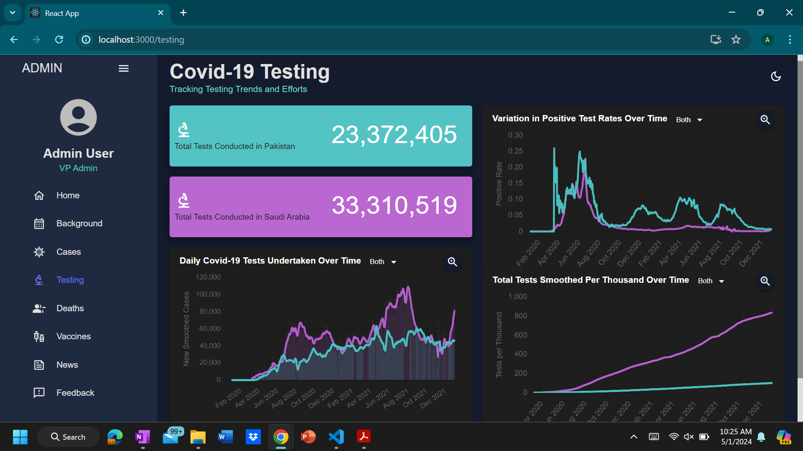

# COVID-19 Visualization Dashboard

## Overview
This project is an interactive COVID-19 dashboard designed to visualize pandemic trends and media coverage, focusing on Saudi Arabia and Pakistan. It uses ReactJS and various data visualization libraries to present comprehensive pandemic data and news headline analysis.

## Features
- Visualizations of COVID-19 data including cases, deaths, and vaccinations.
- Natural language processing to analyze pandemic-related news headlines.
- Interactive charts and maps to enhance user engagement.

An example of one of the pages from the dashboard is shown below:

This page visualizes the testing aspect of the pandemic.

## Status 
While most of the project is complete, future work involves resolving any bug fixes and integrating a database system to store user feedback along with their details to get back to them.  This would also help respond more efficiently to user inquiries and help tailor the dashboard to better meet user needs. 

## Installation
- **Clone the repository:**
git clone https://github.com/amal-zmanzoor/covid-dashboard.git

- **Navigate to the project directory:**
cd covid-dashbaord

- **Install dependencies:**
npm install

- **Start the application:**
npm start

